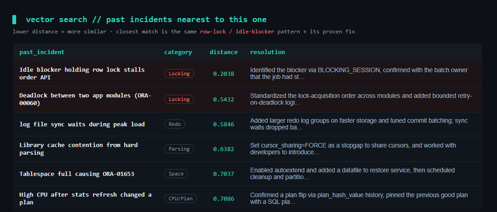
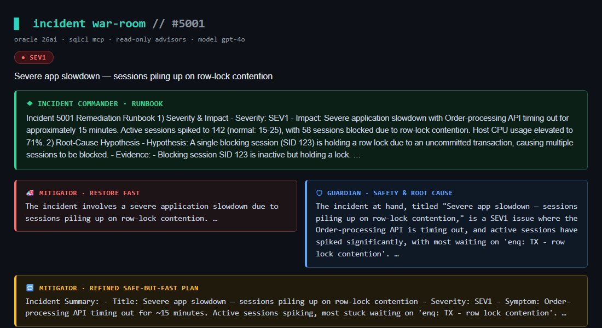

# AI DBAs That Argue Their Way to a Runbook: An Incident War-Room on Oracle 26ai

*What if, the moment an incident hit, two AI DBAs investigated your database and debated the fix — one pushing to restore service fast, one guarding against risk — and handed you a runbook? Here's how I built exactly that on Oracle 26ai with the SQLcl MCP Server.*

---

**📋 At a glance**

- **Tech stack:** Oracle 26ai · SQLcl MCP Server · OpenAI · Streamlit
- **Database:** Oracle AI Database 26ai — 23.26.2.2.0 (Autonomous Database)
- **Prerequisites:** SQLcl 25.2+ (MCP), Python 3.10+, OpenAI API key, Streamlit
- **Best for:** Read-only, AI-assisted DBA incident triage that produces a runbook — no write access to production needed.
- **Level:** Intermediate

## The idea in one sentence

When a database incident lands, I don't ask one AI "what's wrong?" — I let **three AI DBAs work the incident together**: a **Mitigator** who wants service back *now*, a **Guardian** who challenges the risk and hunts the root cause, and an **Incident Commander** who weighs both and writes the runbook. All three read the same live diagnostics from Oracle 26ai.

Why make them argue? Because under pressure, the fast fix and the safe fix are often different things. A "just kill the blocking session" reflex can roll back a half-finished batch job. Forcing the two viewpoints into the open gets you a decision you can actually defend at the post-mortem.

## Why 26ai makes this practical

As an Oracle ACE, two features make this genuinely easy today:

- **The SQLcl MCP Server** — lets AI agents run queries against the database over a standard protocol, using a saved connection, *without ever seeing your password*. Start it with one command: `sql -mcp`.
- **AI Vector Search** — lets the agents ask "have we seen this before?" against a knowledge base of past incidents, in plain SQL. That's retrieval-augmented troubleshooting, right inside the database.

## The most important design choice: the agents are read-only

This is non-negotiable for me. The agents can **only run `SELECT`** queries — the code rejects anything else. They never `KILL` a session, never `ALTER`, never run DML. When a fix requires a change, they *recommend* the exact command, tagged **"needs approval"**, for a human to run. The AI investigates and advises; a person stays in control of every change.

I also debate a *captured snapshot* of the incident (saved `v$session`/`v$sql`-style data), so running the demo never loads or destabilises a real database.

## The incident

Our test incident is a classic **SEV1**: the order API is timing out, active sessions have spiked to ~140, and 58 of them are stuck on `enq: TX - row lock contention`. The whole pile-up traces back to **one idle session** — a stalled nightly batch job (SID 123) holding a row lock from an **uncommitted** `UPDATE`.

That's the perfect argument starter: kill SID 123 and 58 sessions are freed instantly… but it's a batch job mid-transaction. What happens to its work?

## "Have we seen this before?" — vector search over past incidents

Before recommending anything risky, the Guardian searches a knowledge base of past incidents. The current symptoms get matched, by meaning, against what we've resolved before:

*The closest past incident is the same idle-blocker / row-lock pattern — along with how we safely resolved it last time.*

The top hit (distance 0.20) is exactly our situation, and it carries the proven playbook: *identify the blocker, confirm with the batch owner, then kill — the small transaction rolled back in seconds.* That precedent is gold during a live incident.

## The debate, and the runbook

Each agent investigates with read-only SQL, then makes its case. The Mitigator wants SID 123 gone now; the Guardian insists on confirming the transaction's blast radius first and cites the precedent; the Mitigator refines into a safe-but-fast plan; and the Commander turns it all into an ordered runbook:

*Mitigator vs Guardian, and the Incident Commander's runbook — every step grounded in the live diagnostics.*

The Commander's runbook marks each step **[SAFE / READ-ONLY]** or **[CHANGE — needs approval]**, gives the exact commands, and finishes with a rollback plan and what to monitor for recovery. In other words: a junior DBA could follow it, and a senior DBA would sign off on it.

## A few tips from building it

- **Keep the agents read-only.** Enforce it in code, not just in the prompt. Recommending a `KILL` is fine; executing one autonomously is not.
- **Real vector SQL.** Oracle uses `VECTOR_DISTANCE(column, query, COSINE)` with `FETCH APPROX FIRST n ROWS ONLY`.
- **The MCP server is SQLcl's** — `sql -mcp` with a saved connection. The agents reach the DB through it and every query is audited like any other session.
- **Debate a snapshot.** Capturing the incident state into tables makes the whole thing reproducible and completely safe to demo.

## The takeaway

An AI that confidently tells you to "kill the blocker" is easy to build and dangerous to trust. An AI *war-room* — fast vs. safe, grounded in live data and past experience, advising rather than acting — is something I'd actually want next to me at 2am. And on Oracle 26ai, with the SQLcl MCP Server and AI Vector Search, it's only a couple hundred lines of code.

---

*About the author: **Prashant Khadayate** is an **Oracle ACE** focused on the Oracle AI Database (26ai), AI Vector Search, and the SQLcl MCP Server. Connect on [LinkedIn](https://www.linkedin.com/in/prashant-khadayate-1a8b0b97/) for more hands-on Oracle AI experiments.*

> ⚠️ A learning demo — review any recommended command before running it against a real database.
